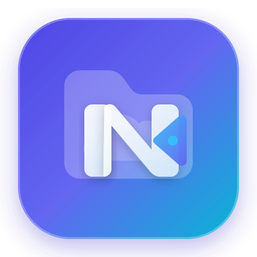

<p align="center">
  
</p>

<h1 align="center">File Browser Next</h1>

<p align="center">
  <b>A modern, secure, next-generation web-based file manager.</b>
</p>

<p align="center">
  <a href="https://filebrowsernext.github.io/filebrowserNEXT/"></a>
  <a href="https://github.com/FilebrowserNext/filebrowserNEXT/releases/latest"></a>
  <a href="https://github.com/orgs/FilebrowserNext/packages/container/package/filebrowsernext"></a>
  <a href="https://github.com/FilebrowserNext/get"></a>
  <a href="#security-resolutions"></a>
  <a href="#modern-ui--experience"></a>
  <a href="LICENSE"></a>
</p>

<p align="center">
  
</p>

---

**File Browser Next** is an actively maintained, modernized continuation of the original File Browser project. It provides a sleek file managing interface within a specified directory, allowing you to upload, delete, preview, and edit your files from any browser on desktop or mobile.

**Official Documentation & Live Showcase:** [filebrowsernext.github.io/filebrowserNEXT](https://filebrowsernext.github.io/filebrowserNEXT/)

---

## Security Resolutions

File Browser Next specifically resolves the critical security architecture issues previously documented in upstream File Browser:

### 1. Session & JWT Revocation ([#5216](https://github.com/filebrowser/filebrowser/issues/5216) — Resolved)
- **Persistent Server-Side Revocation Store**: Implemented a dedicated BoltDB-backed revocation store with in-memory fast-lookup caching and automatic expired token cleanup.
- **Dedicated Logout Endpoint (`POST /api/logout`)**: Calling logout instantly revokes the JWT server-side via its cryptographic `jti` and clears client authentication cookies.
- **Targeted Session Invalidation**: Every user account tracks an `UpdatedAt` timestamp. Only security-sensitive changes (password, permissions, username, scope, rules) invalidate existing sessions. Cosmetic preference updates (language, view mode, theme) no longer disconnect the user.
- **Single-Use Token Renewal**: When renewing an active session token, the previous token (`jti`) is immediately revoked, preventing token replay attacks.
- **Strict Error Handling**: Tokens referencing deleted users or invalid states now properly return `401 Unauthorized` instead of internal server errors.

### 2. Command Runner & Execution Hardening ([#5199](https://github.com/filebrowser/filebrowser/issues/5199) — Resolved)
- **Strict Working Directory Confinement**: Execution working directories are strictly confined within the user's isolated scope using canonical path traversal checks (`filepath.Rel`). Commands can never escape their designated filesystem boundary.
- **Shell Metacharacter Sanitization**: Non-admin executions strictly prohibit shell injection primitives (`;`, `&`, `|`, `` ` ``, `$`, `\n`, `>`, `<`) via `runner.HasDangerousShellMetachars()`.
- **Safe Direct Binary Execution**: Non-admin commands execute binaries directly without passing strings through an unconstrained shell interpreter.

### 3. Authentication Usability Bugs (Resolved)
- **Case-Insensitive Login**: Username lookup at login is now case-insensitive. Typing `Admin` or `ADMIN` correctly authenticates as `admin`, matching the behavior users expect.
- **No Spurious Logouts on Preference Save**: In the original codebase, saving any user preference (language, view mode, etc.) updated `UpdatedAt` and silently invalidated the active session, forcing a re-login. This is now fixed.

### 4. Brute Force Protection with Reverse-Proxy Awareness (New)
- **Login Rate Limiting**: `POST /api/login` is limited to 10 attempts per IP per 5-minute window. Exceeding the limit returns `HTTP 429 Too Many Requests`. Legitimate users connecting normally are never affected.
- **Share Password Rate Limiting**: Password attempts on protected public shares are limited to 10 per IP per share per 5-minute window.
- **Secure Proxy-Aware IP Detection**: The real client IP is resolved correctly whether the app is exposed directly or placed behind a reverse proxy (Cloudflare, Caddy, Nginx, Pangolin, etc.). Proxy headers (`CF-Connecting-IP`, `X-Real-IP`, `X-Forwarded-For`) are trusted **only when the direct TCP connection comes from a private or loopback address** (i.e. from a local proxy). When the app is accessed directly from the internet, these headers are ignored entirely — a public client cannot forge a fake IP to bypass rate limiting.

### 5. Hardened HTTP Security Headers (New)
All API and page responses now include the following headers in addition to `Content-Security-Policy`:
- `X-Frame-Options: DENY` — prevents clickjacking by blocking the app from being embedded in an `<iframe>` on a third-party page.
- `X-Content-Type-Options: nosniff` — prevents browsers from MIME-sniffing responses away from the declared content type.
- `Referrer-Policy: strict-origin-when-cross-origin` — limits referrer information sent to third-party sites.
- `Permissions-Policy: camera=(), microphone=(), geolocation=()` — explicitly disables browser APIs that a file manager has no need for.

---


## Modern UI & Experience

File Browser Next features a complete visual redesign:
- **Modern Design System**: Refreshed color tokens featuring an elegant indigo/slate theme, soft multi-layer box shadows, and 8px/12px/16px rounded borders.
- **Glassmorphic Elements**: Modern blur backdrops (`backdrop-filter: blur(16px)`) on top navigation bars, action bars, modals, and file selection docks.
- **Redesigned Login Page**: Card layout with ambient mesh gradients, improved form controls, and responsive styling.
- **New Logo & Identity**: A sleek vector emblem with vibrant indigo-to-cyan gradients.
- **Responsive File Views**: Polished grid cards, clean list rows, smooth hover elevations, and modern multi-selection pill docks.

---

## Getting Started

### Quick Install (Linux & macOS)

Run the automated install script:

```bash
curl -fsSL https://raw.githubusercontent.com/FilebrowserNext/get/main/get.sh | bash
```

Once installed, start the server:

```bash
filebrowser -r /path/to/your/files
```

Access the web interface at `http://127.0.0.1:8080`.

### Quick Install (Windows)

Run PowerShell as Administrator:

```powershell
iwr -useb https://raw.githubusercontent.com/FilebrowserNext/get/main/get.ps1 | iex
```

Once installed, launch from any terminal:

```powershell
filebrowser -r C:\path\to\your\files
```

### Running with Docker

File Browser Next runs as an ultra-lightweight standalone container (approx. 26 MB).

#### Docker Compose (Recommended)

```yaml
services:
  filebrowser:
    image: ghcr.io/filebrowsernext/filebrowsernext:latest
    container_name: filebrowser
    restart: unless-stopped
    ports:
      - "8080:80"
    volumes:
      - /path/to/your/files:/srv
      - /path/to/database:/database
```

Start the service:
```bash
docker compose up -d
```

#### Docker Run (Single Command)

```bash
docker run -d \
  --name filebrowser \
  --restart unless-stopped \
  -p 8080:80 \
  -v /path/to/your/files:/srv \
  -v /path/to/database:/database \
  ghcr.io/filebrowsernext/filebrowsernext:latest

```

### Running in the Background

#### Linux & macOS (Nohup)

```bash
nohup filebrowser -r /path/to/your/files > filebrowser.log 2>&1 &
```
Stop with: `pkill filebrowser`

#### Linux Service (Systemd)

```bash
sudo tee /etc/systemd/system/filebrowser.service > /dev/null <<EOF
[Unit]
Description=File Browser Next
After=network.target

[Service]
ExecStart=/usr/local/bin/filebrowser -r /path/to/your/files
Restart=on-failure
User=nobody

[Install]
WantedBy=multi-user.target
EOF

sudo systemctl daemon-reload && sudo systemctl enable --now filebrowser
```

#### Windows (PowerShell)

```powershell
Start-Process filebrowser -ArgumentList "-r C:\path\to\your\files" -WindowStyle Hidden
```
Stop with: `Stop-Process -Name filebrowser`


### Building from Source

**Requirements:**
- Go 1.23+
- Node.js 20+ & pnpm

```bash
# 1. Build the Frontend
cd frontend
pnpm install
pnpm run build
cd ..

# 2. Build the Go Binary (embeds frontend)
go build -o filebrowser .
```

---

## Documentation

- General documentation on installation and configuration can be found in the [`docs`](docs) directory.
- For development guidelines, see [CONTRIBUTING.md](CONTRIBUTING.md).

---

## License

[Apache License 2.0](LICENSE) © File Browser Next Contributors & File Browser Authors.
