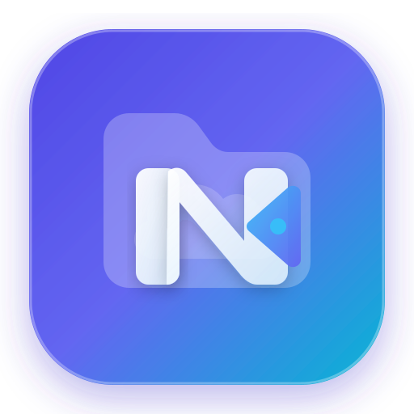

  
  <h1 style="margin: 8px 0 6px 0; font-size: 2.1rem; font-weight: 800; letter-spacing: -0.5px;">File Browser Next</h1>
  

    A modern, secure web file manager and personal cloud. Fast, lightweight, and self-hosted.
  

  

    v3.0.0-next
    Security Hardened
    Modern Glassmorphic UI
  

  

    <a href="installation/" class="md-button md-button--primary" style="font-weight: 600; padding: 6px 18px;">Get Started</a>
    <a href="https://github.com/FilebrowserNext/filebrowserNEXT" class="md-button" style="font-weight: 600; padding: 6px 18px;">GitHub</a>
  

  

## Key Features

-   **Easy Login System**

    ---

    Secure authentication with server-side JWT revocation, session timeouts, and instant invalidation on password change.

    

-   **Modern Sleek Interface**

    ---

    Glassmorphic design system with ambient dark and crisp light themes, responsive card layouts, and smooth animations.

    

-   **User Management**

    ---

    Granular per-user permissions, isolated home directories (scopes), and administrative controls.

    

-   **File Editing & Previews**

    ---

    Integrated syntax-highlighted code editor, markdown viewer, image viewer, audio player, and video streaming.

    

-   **Hardened Command Runner**

    ---

    Secured execution engine confined strictly within user directory scopes, with shell injection filtering.

    

-   **Deep Customization**

    ---

    Custom branding, themes, logos, stylesheets, and PWA capabilities.

    

## Documentation Sections

- [Installation](installation.md)
- [Deployment](deployment.md)
- [Authentication](authentication.md)
- [Customization](customization.md)
- [Command Execution](command-execution.md)
- [Troubleshooting](troubleshooting.md)
- [Command Line Usage](cli/filebrowser.md)
- [Contributing](contributing.md)
- [Security Policy](security.md)
- [Changelog](changelog.md)

