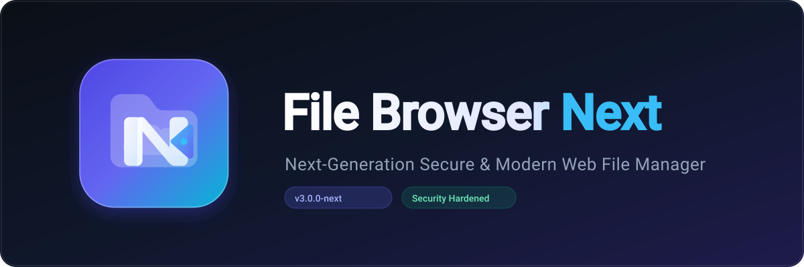
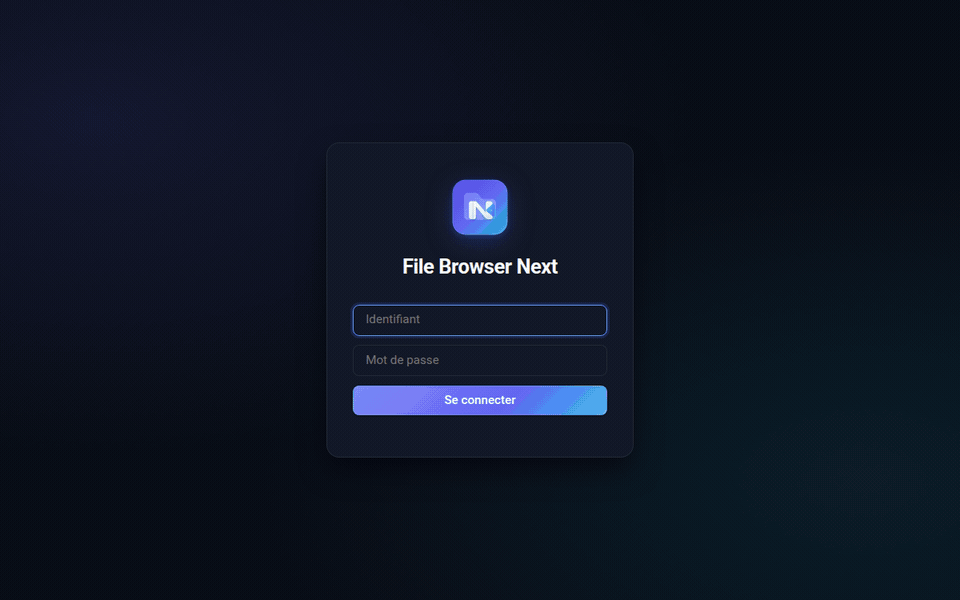
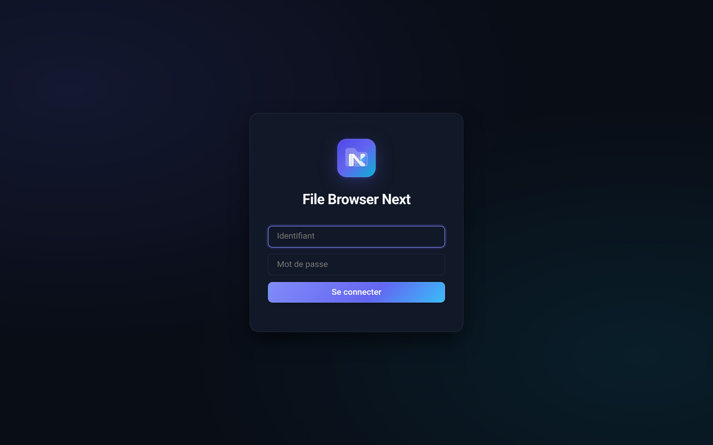
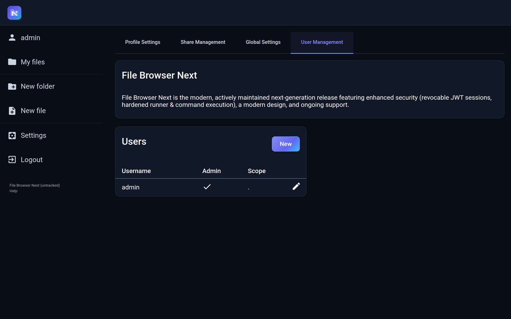
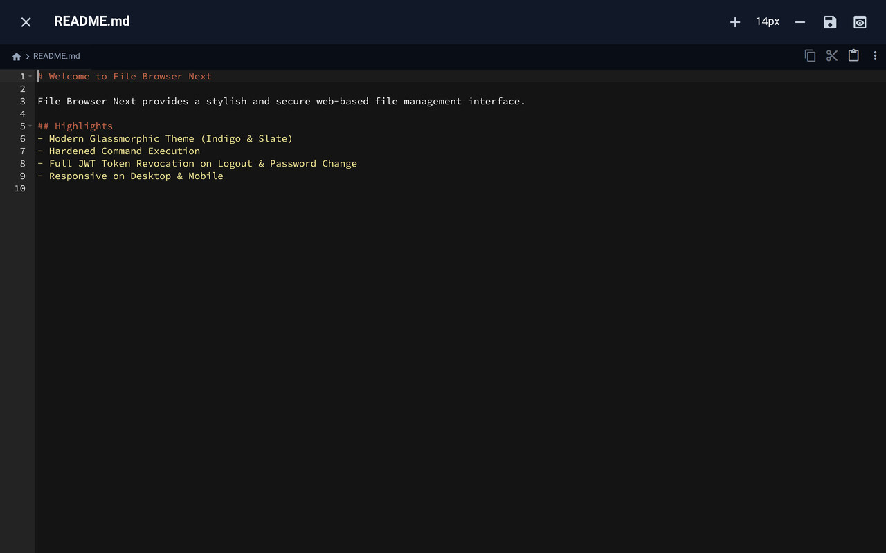
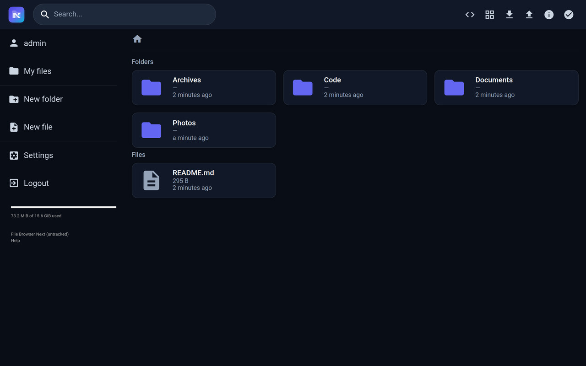
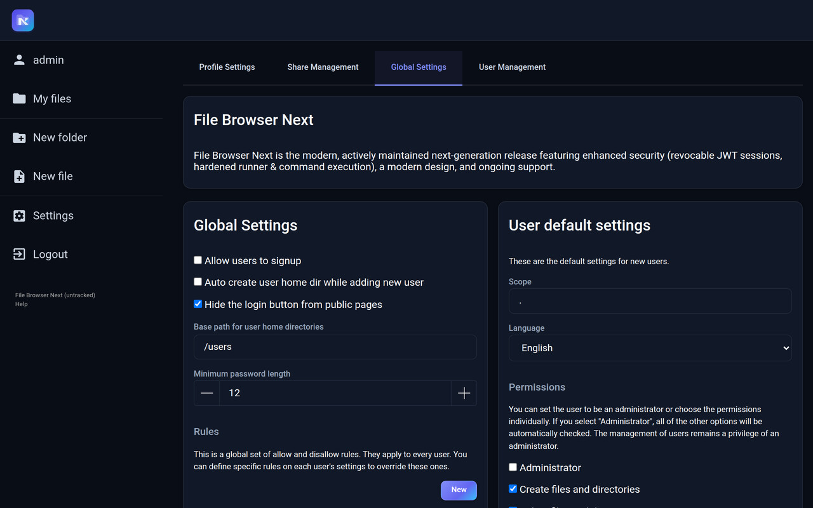

  

# File Browser Next

**File Browser Next** provides a powerful file managing interface within a specified directory, allowing you to upload, delete, preview, and edit your files from any browser on desktop or mobile. It is a **create-your-own-cloud** software where you can install it on your server, direct it to a path, and access your files through a modern, secure web interface.

## Key Features

-   **Easy Login System**

    ---

    Secure authentication with server-side JWT revocation, session timeouts, and instant invalidation on password change.

    

-   **Modern Sleek Interface**

    ---

    Glassmorphic design system with ambient dark and crisp light themes, responsive card layouts, and smooth animations.

    

-   **User Management**

    ---

    Granular per-user permissions, isolated home directories (scopes), and administrative controls.

    

-   **File Editing & Previews**

    ---

    Integrated syntax-highlighted code editor, markdown viewer, image viewer, audio player, and video streaming.

    

-   **Hardened Command Runner**

    ---

    Secured execution engine confined strictly within user directory scopes, with shell injection filtering.

    

-   **Deep Customization**

    ---

    Custom branding, themes, logos, stylesheets, and PWA capabilities.

    

## Documentation Sections

- [Installation](installation.md)
- [Deployment](deployment.md)
- [Authentication](authentication.md)
- [Customization](customization.md)
- [Command Execution](command-execution.md)
- [Troubleshooting](troubleshooting.md)
- [Command Line Usage](cli/filebrowser.md)
- [Contributing](contributing.md)
- [Security Policy](security.md)
- [Changelog](changelog.md)

